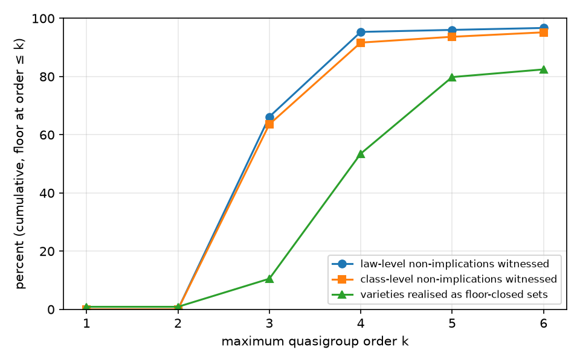

<!-- Generated by analysis/report.py from data/derived/. Do not edit by hand. -->

# quadratula: the refutation floor of Schröder's 990 quasigroup laws

Ground truth: Bruno Le Floch, *Implication semilattice of 990 quasigroup equational laws*, [arXiv:2603.29909v1](https://arxiv.org/abs/2603.29909) (31 March 2026), CC BY 4.0. This report measures a quantity Le Floch's data makes computable; it does not revise his result, which is complete.

## Headline

Le Floch's data has two levels that are easy to conflate: the 990 laws fall into **47 equivalence classes**, and conjunctions of laws define **114 varieties** (logically closed subsets, including the empty and the full set). Both are measured below.

**Quasigroups of order at most 4** (42 isomorphism classes in total) witness **91.68%** of the 1,958 non-implications between classes (95.34% of the 726,207 non-implications between laws), cut the 47 classes into **38 blocks** (30 classes separated from all others), and realise **61 of the 114 varieties** as intersections of their signatures.

The 5 quasigroups of order 3 alone witness 66.19% of law non-implications; the 35 of order 4 add 29.15%. Up to law equivalence and the six parastrophes, the 979,110 ordered law pairs shrink to 550 orbits of class pairs, a 1780× collapse; 481 of those orbits are non-implications.

**Order at most 6** (1,131,984 isomorphism classes) brings this to 95.20% of class non-implications, 96.70% of law non-implications, 44 blocks (42 of 47 classes separated) and 94 of 114 varieties.

**The floor does not finish the job.** At order 6, 94 class-level non-implications (23,976 law pairs) still have no witness, 2 groups of classes are still merged, and 20 varieties are not realised. Because the floor is exhaustive, any finite witness for these has order at least 7. The last two orders add little: order 5 adds 39 class pairs and order 6 adds 30, against 550 for order 4.

No quasigroup of order ≤ 6 refutes any implication Le Floch proves, and every one of the 57 distinct signatures is one of his 114 closed sets (see [CONTROLS.md](CONTROLS.md)).

A cover of **17 quasigroups** (proven optimal by ILP; greedy needs 20) witnesses every non-implication the floor witnesses. Their tables are printed in section 4.

The sections after the divider go past this question, to orders 7–9; they are kept separate from the measurement above.

## Definitions and denominators

- A quasigroup of order n is an n×n Latin square. `a // b` is the `c` with `c * a = b` and `a \\ b` is the `c` with `b * c = a`: Le Floch's conjugate divisions (CONTROLS.md, step 0).
- `sig(Q)` is the set of the 990 laws Q satisfies. Q witnesses `i ↛ j` iff `i ∈ sig(Q)` and `j ∉ sig(Q)`.
- The floor at order k is all quasigroups of order ≤ k up to isomorphism.
- Law-level denominator: 979,110 ordered pairs of distinct laws, of which 252,903 are implications and 726,207 are non-implications.
- Class-level denominator: 2,162 ordered pairs of distinct classes, 204 implications, 1,958 non-implications.
- A variety is realised at order k if it equals the intersection of some set of signatures of the floor (the empty intersection is the full set). Denominator: 114.

## 1. Trivial-only laws

Laws satisfied by no quasigroup of order 2..k: k=2: 0, k=3: 0, k=4: 0, k=5: 0, k=6: 0. The single quasigroup of order 2 already satisfies 990 of the 990 laws, so no law forces triviality and no pair is made vacuous (0 vacuous pairs). It also witnesses nothing: orders 1 and 2 contribute 0 witnessed pairs.

## 2. Saturation curve



| max order k | iso classes ≤ k | law non-implications witnessed (of 726,207) | share | class non-implications witnessed (of 1,958) | share |
|---|---|---|---|---|---|
| 1 | 1 | 0 | 0.00% | 0 | 0.00% |
| 2 | 2 | 0 | 0.00% | 0 | 0.00% |
| 3 | 7 | 480,657 | 66.19% | 1,245 | 63.59% |
| 4 | 42 | 692,343 | 95.34% | 1,795 | 91.68% |
| 5 | 1,453 | 697,407 | 96.03% | 1,834 | 93.67% |
| 6 | 1,131,984 | 702,231 | 96.70% | 1,864 | 95.20% |

## 3. Class separation and varieties (headline)

Laws with identical signature columns over the floor form one block. Equivalent laws always share a column, so blocks are unions of Le Floch's classes; the partition can only be coarser than the 47 classes.

| max order k | blocks (of 47 classes) | classes separated from all others (of 47) | groups of merged classes | varieties realised (of 114) | varieties that are a single signature | classes split by the floor |
|---|---|---|---|---|---|---|
| 1 | 1 | 0 | 1 | 1 | 1 | 0 |
| 2 | 1 | 0 | 1 | 1 | 1 | 0 |
| 3 | 12 | 0 | 12 | 12 | 5 | 0 |
| 4 | 38 | 30 | 8 | 61 | 26 | 0 |
| 5 | 41 | 36 | 5 | 91 | 48 | 0 |
| 6 | 44 | 42 | 2 | 94 | 57 | 0 |

Classes still merged, by representative:

- order ≤ 3: {Sch-1, Sch-88, Sch-93, Sch-127, Sch-336}; {Sch-2, Sch-56}; {Sch-3, Sch-65}; {Sch-4, Sch-100}; {Sch-5, Sch-23, Sch-24}; {Sch-6, Sch-156, Sch-161, Sch-183, Sch-504}; {Sch-7, Sch-9, Sch-10, Sch-14, Sch-20, Sch-25, Sch-38, Sch-54, Sch-60, Sch-79, Sch-101, Sch-102, Sch-202, Sch-224}; {Sch-8, Sch-123}; {Sch-12, Sch-18, Sch-29, Sch-103, Sch-264}; {Sch-15, Sch-105}; {Sch-34, Sch-140}; {Sch-408, Sch-432, Sch-654}
- order ≤ 4: {Sch-3, Sch-65}; {Sch-5, Sch-23}; {Sch-7, Sch-38, Sch-79}; {Sch-8, Sch-123}; {Sch-15, Sch-105}; {Sch-29, Sch-103}; {Sch-93, Sch-127}; {Sch-161, Sch-183}
- order ≤ 5: {Sch-3, Sch-65}; {Sch-5, Sch-23}; {Sch-7, Sch-38, Sch-79}; {Sch-8, Sch-123}; {Sch-15, Sch-105}
- order ≤ 6: {Sch-5, Sch-23}; {Sch-7, Sch-38, Sch-79}

Varieties not realised at order ≤ 6 (20), named by a smallest generating set of representatives in Le Floch's style:

Sch-(103, 127), Sch-(103, 202), Sch-(161, 224), Sch-(202, 408, 432), Sch-(224, 432, 654), Sch-(23), Sch-(34, 102), Sch-(34, 54), Sch-(34, 54, 102), Sch-(38), Sch-(4, 102), Sch-(4, 102, 224), Sch-(4, 224), Sch-(54, 127), Sch-(54, 202, 224), Sch-(54, 408, 654), Sch-(56, 102), Sch-(56, 102, 202), Sch-(56, 202), Sch-(79)

## 4. Minimum cover

Universe: the 1,864 class-level non-implications witnessed at order ≤ 6 (702,231 law pairs; a class pair is covered exactly when all its law pairs are). Candidates: the 57 distinct signatures, one least table each. Solver: HiGHS through `highspy`.

| method | size | status |
|---|---|---|
| greedy (most new pairs; ties to smaller order, then smaller table) | 20 | heuristic |
| LP relaxation lower bound | 17.0000 | Optimal |
| ILP optimum | 17 | Optimal |

Greedy is 3 above the optimum. Among optimal covers, the one below minimises the sum of orders (76; Optimal).

Optimal cover size when only quasigroups of order ≤ k may be used, covering what order ≤ k witnesses:

| max order k | class pairs to cover | optimal cover size |
|---|---|---|
| 1 | 0 | 0 |
| 2 | 0 | 0 |
| 3 | 1,245 | 4 |
| 4 | 1,795 | 14 |
| 5 | 1,834 | 17 |
| 6 | 1,864 | 17 |

Order profile of the optimal cover: order 3: 4, order 4: 4, order 5: 6, order 6: 3.

The covering quasigroups (rows of the `*` table on {0..n-1}; `variety` is the variety the signature defines):

**C1**: order 3, satisfies 150 laws, variety Sch-(3), covers 462 class pairs (126,000 law pairs)

```
0 1 2
1 2 0
2 0 1
```

**C2**: order 3, satisfies 150 laws, variety Sch-(8), covers 462 class pairs (126,000 law pairs)

```
0 1 2
2 0 1
1 2 0
```

**C3**: order 3, satisfies 150 laws, variety Sch-(15), covers 462 class pairs (126,000 law pairs)

```
0 2 1
1 0 2
2 1 0
```

**C4**: order 3, satisfies 324 laws, variety Sch-(24), covers 546 class pairs (215,784 law pairs)

```
0 2 1
2 1 0
1 0 2
```

**C5**: order 4, satisfies 60 laws, variety Sch-(14), covers 246 class pairs (55,800 law pairs)

```
0 1 2 3
2 3 0 1
3 2 1 0
1 0 3 2
```

**C6**: order 4, satisfies 60 laws, variety Sch-(101), covers 246 class pairs (55,800 law pairs)

```
0 2 3 1
1 3 2 0
2 0 1 3
3 1 0 2
```

**C7**: order 4, satisfies 60 laws, variety Sch-(60), covers 246 class pairs (55,800 law pairs)

```
0 2 3 1
2 0 1 3
3 1 0 2
1 3 2 0
```

**C8**: order 4, satisfies 162 laws, variety Sch-(10), covers 442 class pairs (134,136 law pairs)

```
0 2 3 1
3 1 0 2
1 3 2 0
2 0 1 3
```

**C9**: order 5, satisfies 19 laws, variety Sch-(2, 54), covers 210 class pairs (18,449 law pairs)

```
0 1 2 3 4
2 3 1 4 0
3 0 4 2 1
4 2 0 1 3
1 4 3 0 2
```

**C10**: order 5, satisfies 82 laws, variety Sch-(20), covers 246 class pairs (74,456 law pairs)

```
0 2 1 4 3
3 1 4 0 2
4 3 2 1 0
2 4 0 3 1
1 0 3 2 4
```

**C11**: order 5, satisfies 19 laws, variety Sch-(54, 100), covers 210 class pairs (18,449 law pairs)

```
0 2 3 4 1
1 3 0 2 4
2 1 4 0 3
3 4 2 1 0
4 0 1 3 2
```

**C12**: order 5, satisfies 82 laws, variety Sch-(25), covers 246 class pairs (74,456 law pairs)

```
0 2 3 4 1
2 1 4 0 3
3 4 2 1 0
4 0 1 3 2
1 3 0 2 4
```

**C13**: order 5, satisfies 82 laws, variety Sch-(9), covers 246 class pairs (74,456 law pairs)

```
0 2 3 4 1
3 1 4 2 0
4 0 2 1 3
1 4 0 3 2
2 3 1 0 4
```

**C14**: order 5, satisfies 19 laws, variety Sch-(127, 140), covers 210 class pairs (18,449 law pairs)

```
0 2 3 4 1
4 0 1 3 2
1 3 0 2 4
2 1 4 0 3
3 4 2 1 0
```

**C15**: order 6, satisfies 16 laws, variety Sch-(65), covers 172 class pairs (15,584 law pairs)

```
0 1 2 3 4 5
1 0 3 2 5 4
2 4 0 5 1 3
3 5 1 4 0 2
4 2 5 0 3 1
5 3 4 1 2 0
```

**C16**: order 6, satisfies 16 laws, variety Sch-(123), covers 172 class pairs (15,584 law pairs)

```
0 1 2 3 4 5
1 0 3 2 5 4
2 4 0 5 1 3
4 2 5 0 3 1
3 5 1 4 0 2
5 3 4 1 2 0
```

**C17**: order 6, satisfies 16 laws, variety Sch-(105), covers 172 class pairs (15,584 law pairs)

```
0 1 2 3 5 4
1 0 4 5 3 2
2 5 0 4 1 3
3 4 5 0 2 1
4 3 1 2 0 5
5 2 3 1 4 0
```

Machine-readable: `data/cover/min_cover.tsv`.

## 5. Distinct signatures per order

| order n | iso classes at order n | distinct signatures at order n | new at order n | cumulative ≤ n | S3-canonical at order n | S3-canonical cumulative |
|---|---|---|---|---|---|---|
| 1 | 1 | 1 | 1 | 1 | 1 | 1 |
| 2 | 1 | 1 | 0 | 1 | 1 | 1 |
| 3 | 5 | 4 | 4 | 5 | 2 | 3 |
| 4 | 35 | 26 | 21 | 26 | 12 | 12 |
| 5 | 1,411 | 33 | 22 | 48 | 13 | 20 |
| 6 | 1,130,531 | 33 | 9 | 57 | 13 | 23 |

Isomorphism classes grow by 801× from order 5 to 6; distinct behaviours grow from 48 to 57. Behaviour space is bounded above by the number of varieties, since every signature is a closed set.

## 6. Parastrophe collapse

The six parastrophes act on the law list itself: each σ maps the 990 laws bijectively onto the list (CONTROLS.md, G4). Fixed laws per σ: 012: 990, 021: 36, 102: 36, 120: 0, 201: 0, 210: 36.

| object | size | orbits under S3 | collapse factor |
|---|---|---|---|
| laws | 990 | 183 | 5.41 |
| ordered pairs of distinct laws | 979,110 | 163,815 | 5.98 |
| law non-implications | 726,207 | 121,470 | 5.98 |
| equivalence classes | 47 | 20 | 2.35 |
| ordered pairs of distinct classes | 2,162 | 550 | 3.93 |
| class non-implications | 1,958 | 481 | 4.07 |
| law pairs → orbits of class pairs (equivalence and S3 combined) | 979,110 | 550 | 1780.20 |
| varieties | 114 | 46 | 2.48 |

The group has order 6, against 2 for the opposite-magma duality in the magma setting. A count that ignores it inflates the law pair space by a factor of 5.98, where duality alone can give at most 2 for magmas.

## 7. Marginal value of each order

| order n | new law pairs witnessed | new class pairs witnessed | new varieties realised | new signatures |
|---|---|---|---|---|
| 1 | 0 | 0 | 1 | 1 |
| 2 | 0 | 0 | 0 | 0 |
| 3 | 480,657 | 1,245 | 11 | 4 |
| 4 | 211,686 | 550 | 49 | 21 |
| 5 | 5,064 | 39 | 30 | 22 |
| 6 | 4,824 | 30 | 3 | 9 |

## Tiny quasigroups

The analogue of the magma result's degenerate objects: one row per distinct signature among the quasigroups of order ≤ 3 (the unique quasigroup of order 2 has the same signature as order 1), with the share of the 726,207 law non-implications it witnesses alone.

| order | table | laws satisfied | variety | law pairs witnessed | share |
|---|---|---|---|---|---|
| 1 | `0` | 990 | Sch-(7) | 0 | 0.00% |
| 3 | `0 1 2 / 1 2 0 / 2 0 1` | 150 | Sch-(3) | 126,000 | 17.35% |
| 3 | `0 1 2 / 2 0 1 / 1 2 0` | 150 | Sch-(8) | 126,000 | 17.35% |
| 3 | `0 2 1 / 1 0 2 / 2 1 0` | 150 | Sch-(15) | 126,000 | 17.35% |
| 3 | `0 2 1 / 2 1 0 / 1 0 2` | 324 | Sch-(24) | 215,784 | 29.71% |

## Residual: class non-implications without a witness of order ≤ 6

94 ordered class pairs `Sch-a ↛ Sch-b`, grouped by `a`:

- Sch-23 ↛ Sch-5, Sch-29, Sch-93, Sch-183
- Sch-38 ↛ Sch-1, Sch-2, Sch-3, Sch-4, Sch-5, Sch-6, Sch-7, Sch-8, Sch-9, Sch-10, Sch-12, Sch-14, Sch-15, Sch-18, Sch-20, Sch-23, Sch-24, Sch-25, Sch-29, Sch-34, Sch-54, Sch-56, Sch-60, Sch-65, Sch-79, Sch-88, Sch-93, Sch-100, Sch-101, Sch-103, Sch-105, Sch-123, Sch-127, Sch-140, Sch-156, Sch-161, Sch-183, Sch-202, Sch-224, Sch-264, Sch-336, Sch-408, Sch-432, Sch-504, Sch-654
- Sch-79 ↛ Sch-1, Sch-2, Sch-3, Sch-4, Sch-5, Sch-6, Sch-7, Sch-8, Sch-9, Sch-10, Sch-12, Sch-14, Sch-15, Sch-18, Sch-20, Sch-23, Sch-24, Sch-25, Sch-29, Sch-34, Sch-38, Sch-54, Sch-56, Sch-60, Sch-65, Sch-88, Sch-93, Sch-100, Sch-101, Sch-103, Sch-105, Sch-123, Sch-127, Sch-140, Sch-156, Sch-161, Sch-183, Sch-202, Sch-224, Sch-264, Sch-336, Sch-408, Sch-432, Sch-504, Sch-654

---

# Extension beyond the original question

Sections 1–7 answer the question this project set out to answer: what quasigroups of order ≤ 6 account for. What follows goes further.

Exactly, up to order 9: quasigroups of order ≤ 9 witness 100.00% of class non-implications, separate 47 of 47 classes and realise 114 of 114 varieties (section 8). Where both exist, the least witness orders of the residual pairs agree with Mace4 (94 of 94).

## Beyond the floor: smallest witnesses for the residual (Mace4; superseded by section 8)

Trust level differs from the rest of the report. For each of the 94 residual pairs, Mace4 (64) version 2009-11A searched quasigroups satisfying the hypothesis and violating the goal at sizes 7..14 in increasing order (time limit 600 s per pair). Orders ≤ 6 are excluded exhaustively by the floor. A reported model is therefore a witness of least order, provided Mace4's search at each smaller size is complete. Every model was re-evaluated with this repository's engine.

| check | result |
|---|---|
| pairs searched | 94 |
| pairs with a witness found | 94 |
| every witness satisfies the hypothesis and violates the goal (our engine) | True |
| every witness signature is one of the varieties | True |
| every smaller size was searched to completion | True |

| least witness order | class pairs |
|---|---|
| 8 | 90 |
| 9 | 4 |

Largest order needed: 9. Adding these 94 witnesses to the order-6 floor gives 3 new signatures, 47 blocks of the 47 classes (from 44) and 98 of 114 varieties realised (from 94); these are lower bounds for the full floor at that order.

- Sch-23 ↛ Sch-5, Sch-29, Sch-93, Sch-183: least witness order 9
- Sch-38 ↛ Sch-1, Sch-2, Sch-3, Sch-4, Sch-5, Sch-6, Sch-7, Sch-8, Sch-9, Sch-10, Sch-12, Sch-14, Sch-15, Sch-18, Sch-20, Sch-23, Sch-24, Sch-25, Sch-29, Sch-34, Sch-54, Sch-56, Sch-60, Sch-65, Sch-79, Sch-88, Sch-93, Sch-100, Sch-101, Sch-103, Sch-105, Sch-123, Sch-127, Sch-140, Sch-156, Sch-161, Sch-183, Sch-202, Sch-224, Sch-264, Sch-336, Sch-408, Sch-432, Sch-504, Sch-654: least witness order 8
- Sch-79 ↛ Sch-1, Sch-2, Sch-3, Sch-4, Sch-5, Sch-6, Sch-7, Sch-8, Sch-9, Sch-10, Sch-12, Sch-14, Sch-15, Sch-18, Sch-20, Sch-23, Sch-24, Sch-25, Sch-29, Sch-34, Sch-38, Sch-54, Sch-56, Sch-60, Sch-65, Sch-88, Sch-93, Sch-100, Sch-101, Sch-103, Sch-105, Sch-123, Sch-127, Sch-140, Sch-156, Sch-161, Sch-183, Sch-202, Sch-224, Sch-264, Sch-336, Sch-408, Sch-432, Sch-504, Sch-654: least witness order 8

Witness tables: `data/derived/residual.json`.

## 8. Beyond order 6, exactly

Every separation still open at order 6 involves a variety not yet realised. Whether a class pair `a ↛ b` is witnessed at order ≤ k depends only on the models of `a`, and whether a variety V is realised at order ≤ k depends only on the models of V. So it is enough to enumerate, exhaustively and up to isomorphism, the models of the 20 varieties missing at order 6 (`qg models`, `src/search.rs`: row-major backtracking that cuts a branch as soon as a required law fails on defined entries, with the enumerator's symmetry breaking and canonicity test). The curves below are exact through the largest order at which every one of these runs finished: **order 9**.

| max order k | class non-implications witnessed (of 1,958) | share | law share | blocks of classes (of 47) | classes separated from all others (of 47) | varieties realised (of 114) |
|---|---|---|---|---|---|---|
| 6 | 1,864 | 95.20% | 96.70% | 44 | 42 | 94 |
| 7 | 1,864 | 95.20% | 96.70% | 44 | 42 | 95 |
| 8 | 1,954 | 99.80% | 99.91% | 46 | 45 | 106 |
| 9 | 1,958 | 100.00% | 100.00% | 47 | 47 | 114 |

Varieties still not realised at order ≤ 9: none.

Least order at which each variety missing at order 6 is realised:

| variety | least realising order |
|---|---|
| Sch-(103, 127) | 7 |
| Sch-(202, 408, 432) | 8 |
| Sch-(224, 432, 654) | 8 |
| Sch-(34, 102) | 8 |
| Sch-(34, 54, 102) | 8 |
| Sch-(38) | 8 |
| Sch-(4, 102) | 8 |
| Sch-(4, 102, 224) | 8 |
| Sch-(54, 408, 654) | 8 |
| Sch-(56, 102) | 8 |
| Sch-(56, 102, 202) | 8 |
| Sch-(79) | 8 |
| Sch-(103, 202) | 9 |
| Sch-(161, 224) | 9 |
| Sch-(23) | 9 |
| Sch-(34, 54) | 9 |
| Sch-(4, 224) | 9 |
| Sch-(54, 127) | 9 |
| Sch-(54, 202, 224) | 9 |
| Sch-(56, 202) | 9 |

Least witness order for the 94 residual class pairs, now exhaustive: it agrees with Mace4 for 94 of them.

- Sch-23 ↛ Sch-5, Sch-29, Sch-93, Sch-183: order 9
- Sch-38 ↛ Sch-1, Sch-2, Sch-3, Sch-4, Sch-5, Sch-6, Sch-7, Sch-8, Sch-9, Sch-10, Sch-12, Sch-14, Sch-15, Sch-18, Sch-20, Sch-23, Sch-24, Sch-25, Sch-29, Sch-34, Sch-54, Sch-56, Sch-60, Sch-65, Sch-79, Sch-88, Sch-93, Sch-100, Sch-101, Sch-103, Sch-105, Sch-123, Sch-127, Sch-140, Sch-156, Sch-161, Sch-183, Sch-202, Sch-224, Sch-264, Sch-336, Sch-408, Sch-432, Sch-504, Sch-654: order 8
- Sch-79 ↛ Sch-1, Sch-2, Sch-3, Sch-4, Sch-5, Sch-6, Sch-7, Sch-8, Sch-9, Sch-10, Sch-12, Sch-14, Sch-15, Sch-18, Sch-20, Sch-23, Sch-24, Sch-25, Sch-29, Sch-34, Sch-38, Sch-54, Sch-56, Sch-60, Sch-65, Sch-88, Sch-93, Sch-100, Sch-101, Sch-103, Sch-105, Sch-123, Sch-127, Sch-140, Sch-156, Sch-161, Sch-183, Sch-202, Sch-224, Sch-264, Sch-336, Sch-408, Sch-432, Sch-504, Sch-654: order 8

### Cover of every class non-implication

All 1,958 class-level non-implications are witnessed at order ≤ 9. The smallest cover among the 78 signatures found has **17** quasigroups (Optimal). Every signature of any quasigroup is closed under consequence, hence one of Le Floch's 114 varieties if his list is complete; under that assumption the same ILP over all 114 varieties bounds every possible cover from below: 17 (Optimal). The bounds meet, so this cover is optimal among quasigroups of every order, given his list.

Order profile (minimising total order among optimal covers): order 3: 4, order 4: 4, order 5: 3, order 6: 3, order 8: 2, order 9: 1.

Order 8, variety Sch-(79), covers 90 class pairs:

```
0 2 3 4 5 6 7 1
4 1 6 0 7 3 5 2
5 3 2 7 0 1 4 6
6 7 4 3 1 0 2 5
7 6 1 5 4 2 0 3
1 4 7 2 6 5 3 0
2 0 5 1 3 7 6 4
3 5 0 6 2 4 1 7
```

Order 8, variety Sch-(38), covers 90 class pairs:

```
0 2 3 4 5 6 7 1
6 1 5 7 3 0 4 2
7 3 2 6 1 4 0 5
1 6 4 3 7 2 5 0
2 0 7 5 4 1 3 6
3 7 0 1 6 5 2 4
4 5 1 0 2 7 6 3
5 4 6 2 0 3 1 7
```

Order 9, variety Sch-(23), covers 172 class pairs:

```
1 2 3 4 5 0 6 8 7
4 6 2 7 0 8 5 1 3
3 0 5 2 1 4 8 7 6
0 7 4 8 2 6 3 5 1
5 4 1 0 3 2 7 6 8
2 8 0 6 4 7 1 3 5
8 3 7 1 6 5 2 0 4
7 5 6 3 8 1 0 4 2
6 1 8 5 7 3 4 2 0
```

All member tables: `data/derived/beyond.json` (`full_cover`).

## 9. Model counts by order

Isomorphism classes of quasigroups satisfying each class representative, by order. Orders ≤ 6 come from the floor; larger orders are filled only where an exhaustive run covers the class exactly. Counts for all 114 varieties: `data/signatures/model_counts.tsv`.

| class | n=1 | n=2 | n=3 | n=4 | n=5 | n=6 | n=7 | n=8 | n=9 |
|---|---|---|---|---|---|---|---|---|---|
| Sch-1 | 1 | 1 | 3 | 7 | 11 | 491 |  |  |  |
| Sch-10 | 1 | 1 | 0 | 2 | 0 | 0 | 0 | 2 | 0 |
| Sch-100 | 1 | 1 | 2 | 7 | 10 | 64 |  |  |  |
| Sch-101 | 1 | 1 | 0 | 3 | 0 | 0 |  |  |  |
| Sch-102 | 1 | 1 | 0 | 15 | 0 | 0 |  |  |  |
| Sch-103 | 1 | 1 | 3 | 6 | 8 | 16 |  |  |  |
| Sch-105 | 1 | 1 | 1 | 2 | 1 | 2 |  |  |  |
| Sch-12 | 1 | 1 | 3 | 7 | 11 | 491 |  |  |  |
| Sch-123 | 1 | 1 | 1 | 2 | 1 | 2 |  |  |  |
| Sch-127 | 1 | 1 | 3 | 6 | 8 | 16 |  |  |  |
| Sch-14 | 1 | 1 | 0 | 3 | 0 | 0 |  |  |  |
| Sch-140 | 1 | 1 | 2 | 7 | 10 | 64 |  |  |  |
| Sch-15 | 1 | 1 | 1 | 2 | 1 | 1 |  |  |  |
| Sch-156 | 1 | 1 | 3 | 4 | 2 | 5 |  |  |  |
| Sch-161 | 1 | 1 | 3 | 6 | 8 | 16 |  |  |  |
| Sch-18 | 1 | 1 | 3 | 4 | 2 | 5 |  |  |  |
| Sch-183 | 1 | 1 | 3 | 6 | 6 | 13 |  |  |  |
| Sch-2 | 1 | 1 | 2 | 7 | 10 | 64 |  |  |  |
| Sch-20 | 1 | 1 | 0 | 2 | 3 | 0 |  |  |  |
| Sch-202 | 1 | 1 | 0 | 9 | 22 | 0 |  |  |  |
| Sch-224 | 1 | 1 | 0 | 9 | 22 | 0 |  |  |  |
| Sch-23 | 1 | 1 | 2 | 3 | 4 | 9 | 41 | 595 | 26,623 |
| Sch-24 | 1 | 1 | 2 | 2 | 1 | 3 | 3 | 13 | 12 |
| Sch-25 | 1 | 1 | 0 | 2 | 3 | 0 |  |  |  |
| Sch-264 | 1 | 1 | 3 | 5 | 5 | 13 |  |  |  |
| Sch-29 | 1 | 1 | 3 | 6 | 6 | 13 |  |  |  |
| Sch-3 | 1 | 1 | 1 | 2 | 1 | 1 |  |  |  |
| Sch-336 | 1 | 1 | 3 | 5 | 5 | 13 |  |  |  |
| Sch-34 | 1 | 1 | 2 | 6 | 5 | 2 |  |  |  |
| Sch-38 | 1 | 1 | 0 | 1 | 0 | 0 | 0 | 3 |  |
| Sch-4 | 1 | 1 | 2 | 6 | 5 | 2 |  |  |  |
| Sch-408 | 1 | 1 | 5 | 17 | 85 | 4,003 |  |  |  |
| Sch-432 | 1 | 1 | 5 | 17 | 85 | 4,003 |  |  |  |
| Sch-5 | 1 | 1 | 2 | 3 | 4 | 9 | 41 | 595 | 26,620 |
| Sch-504 | 1 | 1 | 3 | 5 | 5 | 13 |  |  |  |
| Sch-54 | 1 | 1 | 0 | 9 | 22 | 0 |  |  |  |
| Sch-56 | 1 | 1 | 2 | 6 | 5 | 2 |  |  |  |
| Sch-6 | 1 | 1 | 3 | 7 | 11 | 491 |  |  |  |
| Sch-60 | 1 | 1 | 0 | 3 | 0 | 0 |  |  |  |
| Sch-65 | 1 | 1 | 1 | 2 | 1 | 2 |  |  |  |
| Sch-654 | 1 | 1 | 5 | 17 | 85 | 4,003 |  |  |  |
| Sch-7 | 1 | 1 | 0 | 1 | 0 | 0 | 0 | 1 | 0 |
| Sch-79 | 1 | 1 | 0 | 1 | 0 | 0 | 0 | 3 |  |
| Sch-8 | 1 | 1 | 1 | 2 | 1 | 1 |  |  |  |
| Sch-88 | 1 | 1 | 3 | 4 | 2 | 5 |  |  |  |
| Sch-9 | 1 | 1 | 0 | 2 | 3 | 0 |  |  |  |
| Sch-93 | 1 | 1 | 3 | 6 | 6 | 13 |  |  |  |

OEIS lookups of the order-1..6 counts, searching the terms together with "quasigroup", "latin" or "loop" (pinned in `data/controls/oeis_fingerprints.tsv`; six matching terms are a lead, not a proof):

| counts n=1..6 | classes | OEIS | entry | retrieved |
|---|---|---|---|---|
| 1,1,2,2,1,3 | Sch-24 | A076019 | Number of nonisomorphic commutative systems with n elements with one binary operation satisfying the equation B(AB)=A (totally-symmetric quasigroups). (3 hits scanned) | 2026-09-13 |
| 1,1,2,3,4,9 | Sch-5,Sch-23 | A076017 | Number of nonisomorphic systems with n elements with one binary operation satisfying the equation B(AB)=A (semisymmetric quasigroups). (2 hits scanned) | 2026-09-13 |
| 1,1,2,3,4,9 | Sch-5,Sch-23 | A076018 | Number of systems with n elements with one binary operation satisfying the equation B(AB)=A (semisymmetric quasigroups). Isomorphic systems and systems differing by a transposition have been omitted. (2 hits scanned) | 2026-09-13 |
| 1,1,2,6,5,2 | Sch-4,Sch-34,Sch-56 | - | no quasigroup-related entry (0 hits scanned) | 2026-09-13 |
| 1,1,2,7,10,64 | Sch-2,Sch-100,Sch-140 | - | no quasigroup-related entry (0 hits scanned) | 2026-09-13 |
| 1,1,3,4,2,5 | Sch-18,Sch-88,Sch-156 | - | no quasigroup-related entry (0 hits scanned) | 2026-09-13 |
| 1,1,3,5,5,13 | Sch-264,Sch-336,Sch-504 | - | no quasigroup-related entry (0 hits scanned) | 2026-09-13 |
| 1,1,3,6,6,13 | Sch-29,Sch-93,Sch-183 | - | no quasigroup-related entry (0 hits scanned) | 2026-09-13 |
| 1,1,3,6,8,16 | Sch-103,Sch-127,Sch-161 | - | no quasigroup-related entry (0 hits scanned) | 2026-09-13 |
| 1,1,3,7,11,491 | Sch-1,Sch-6,Sch-12 | A057992 | Number of commutative quasigroups of order n. (1 hits scanned) | 2026-09-13 |
| 1,1,5,17,85,4003 | Sch-408,Sch-432,Sch-654 | - | no quasigroup-related entry (0 hits scanned) | 2026-09-13 |

## Compute

| order | enumerate (s) | signatures (s) | plain Latin count (s) | threads |
|---|---|---|---|---|
| 1 | 0.00 | 0.00 | 0.00 | 11 |
| 2 | 0.00 | 0.00 | 0.00 | 11 |
| 3 | 0.00 | 0.00 | 0.00 | 11 |
| 4 | 0.00 | 0.00 | 0.00 | 11 |
| 5 | 0.00 | 0.01 | 0.00 | 11 |
| 6 | 0.99 | 6.13 | 11.93 | 11 |

Machine: Apple M3 Pro, 11 logical cores, 36 GiB; rustc 1.96.0 (ac68faa20 2026-05-25); Python 3.14.6.

## Reproduce

```bash
make reproduce
```

Requires rustup (toolchain pinned by `rust-toolchain.toml`) and uv (Python and packages pinned by `.python-version`, `pyproject.toml`, `uv.lock`).

## Credit

All implication, class and variety data: Bruno Le Floch, *Implication semilattice of 990 quasigroup equational laws*, [arXiv:2603.29909v1](https://arxiv.org/abs/2603.29909) (31 March 2026), CC BY 4.0. Enumeration and signature code adapts parts of [parsimagma](https://github.com/carlok/parsimagma) (Apache-2.0); see NOTICE.
